# RAG, Semantic Kernel & MCP: Complete Integration Guide

## 📋 **Overview**

This guide explains how **RAG (Retrieval-Augmented Generation)**, **Semantic Kernel**, and **MCP (Model Context Protocol)** work together to create powerful AI agents. You'll learn the concepts, see practical implementations, and understand how they integrate in real-world applications.

## 🧠 **Understanding the Core Concepts**

### **RAG (Retrieval-Augmented Generation)**
- **What it is**: An architectural pattern that enhances AI responses with external knowledge
- **Purpose**: Overcome LLM knowledge cutoffs and add domain-specific information
- **Process**: Retrieve relevant data → Augment prompt → Generate response

### **Semantic Kernel**
- **What it is**: Microsoft's AI orchestration SDK
- **Purpose**: Build AI agents, manage conversations, orchestrate plugins
- **Languages**: Python, C#, TypeScript
- **Role**: The "brain" that coordinates everything

### **MCP (Model Context Protocol)**
- **What it is**: Protocol for connecting AI agents to external tools and data sources
- **Purpose**: Standardized way to extend AI capabilities
- **Implementation**: Local processes that provide specialized functions

## 🏗️ **Architecture Overview**

```mermaid
graph TB
    User[👤 User Query] --> SK[🧠 Semantic Kernel Agent]
    SK --> RAG[📚 RAG Memory Plugin]
    SK --> MCP[🔧 MCP Plugin]
    
    RAG --> VectorDB[(🗄️ Vector Database<br/>ChromaDB/Azure AI Search)]
    RAG --> Embedding[🔍 Embedding Model<br/>text-embedding-3-small]
    
    MCP --> MCPServer1[📊 Kubernetes MCP Server]
    MCP --> MCPServer2[💾 Database MCP Server]
    MCP --> MCPServer3[☁️ Azure MCP Server]
    
    VectorDB --> Documents[📄 Documents/Knowledge Base]
    MCPServer1 --> K8s[⚙️ Kubernetes APIs]
    MCPServer2 --> DB[🗃️ Databases]
    MCPServer3 --> Azure[☁️ Azure Services]
    
    SK --> LLM[🤖 Azure OpenAI<br/>GPT-4o]
    LLM --> Response[💬 Enhanced Response]
```



## 🔄 **How They Work Together**

### **Step 1: User Query Processing**
```python
# User asks: "What are the memory issues in our production pods and how do I fix them?"

# 1. Semantic Kernel receives the query
user_query = "What are the memory issues in our production pods and how do I fix them?"
```

### **Step 2: RAG Retrieval**
```python
# 2. RAG plugin searches knowledge base
rag_results = await memory.search_async(
    query="kubernetes memory issues pods troubleshooting",
    limit=5,
    min_relevance_score=0.7
)

# Retrieved context might include:
# - Kubernetes troubleshooting guides
# - Previous incident reports
# - Best practices documentation
```

### **Step 3: MCP Tool Execution**
```python
# 3. MCP plugin calls Kubernetes tools
k8s_data = await mcp_plugin.call_tool(
    "get_pod_metrics",
    {"namespace": "production", "metric": "memory"}
)

# Returns actual current pod memory usage
```

### **Step 4: Response Generation**
```python
# 4. Semantic Kernel combines everything
augmented_prompt = f"""
Context from knowledge base: {rag_results}
Current system data: {k8s_data}
User question: {user_query}

Provide a comprehensive answer using both the documentation and real-time data.
"""

response = await kernel.invoke_prompt_async(augmented_prompt)
```

## 💻 **Practical Implementation**

### **Complete RAG + Semantic Kernel + MCP Example**

```python
# main_rag_mcp_agent.py
import asyncio
import os
from semantic_kernel import Kernel
from semantic_kernel.agents import ChatCompletionAgent
from semantic_kernel.agents.plugins.mcp import MCPPlugin
from semantic_kernel.connectors.ai.open_ai import AzureChatCompletion
from semantic_kernel.memory import SemanticTextMemory
from semantic_kernel.connectors.memory.chroma import ChromaMemoryStore
from semantic_kernel.connectors.ai.open_ai import OpenAITextEmbedding

class RAGMCPAgent:
    def __init__(self):
        self.kernel = Kernel()
        self.setup_azure_openai()
        self.setup_rag_memory()
        self.setup_mcp_plugins()
        self.setup_agent()
    
    def setup_azure_openai(self):
        """Configure Azure OpenAI connection"""
        chat_service = AzureChatCompletion(
            service_id="gpt-4o",
            deployment_name=os.getenv("AZURE_OPENAI_DEPLOYMENT_NAME"),
            endpoint=os.getenv("AZURE_OPENAI_ENDPOINT"),
            api_key=os.getenv("AZURE_OPENAI_API_KEY")
        )
        self.kernel.add_service(chat_service)
        
        # Add embedding service for RAG
        embedding_service = OpenAITextEmbedding(
            service_id="text-embedding",
            deployment_name="text-embedding-3-small",
            endpoint=os.getenv("AZURE_OPENAI_ENDPOINT"),
            api_key=os.getenv("AZURE_OPENAI_API_KEY")
        )
        self.kernel.add_service(embedding_service)
    
    def setup_rag_memory(self):
        """Setup RAG memory with ChromaDB"""
        # Initialize ChromaDB memory store
        memory_store = ChromaMemoryStore(persist_directory="./chroma_db")
        
        # Create semantic memory
        self.memory = SemanticTextMemory(
            storage=memory_store,
            embeddings_generator=self.kernel.get_service("text-embedding")
        )
        
        # Add memory as a plugin
        memory_plugin = self.memory.as_plugin(plugin_name="memory")
        self.kernel.add_plugin(memory_plugin)
    
    def setup_mcp_plugins(self):
        """Setup MCP plugins for external tools"""
        # Kubernetes MCP Server
        k8s_mcp_plugin = MCPPlugin(
            server_command=["npx", "kubernetes-mcp-server"],
            server_parameters={}
        )
        self.kernel.add_plugin(k8s_mcp_plugin, plugin_name="kubernetes")
        
        # Database MCP Server
        db_mcp_plugin = MCPPlugin(
            server_command=["npx", "database-mcp-server"],
            server_parameters={}
        )
        self.kernel.add_plugin(db_mcp_plugin, plugin_name="database")
        
        # File System MCP Server
        fs_mcp_plugin = MCPPlugin(
            server_command=["npx", "filesystem-mcp-server"],
            server_parameters={}
        )
        self.kernel.add_plugin(fs_mcp_plugin, plugin_name="filesystem")
    
    def setup_agent(self):
        """Create the main AI agent"""
        instructions = """
        You are an expert DevOps and Kubernetes assistant with access to:
        
        1. **RAG Knowledge Base**: Comprehensive documentation, troubleshooting guides, and best practices
        2. **Kubernetes Tools**: Real-time cluster monitoring, pod management, and resource analysis
        3. **Database Tools**: Query execution, schema analysis, and performance monitoring
        4. **File System Tools**: Log analysis, configuration management, and report generation
        
        **Your Capabilities**:
        - Analyze real-time system data using MCP tools
        - Reference comprehensive documentation via RAG
        - Provide step-by-step troubleshooting guidance
        - Generate detailed reports and recommendations
        
        **Response Guidelines**:
        - Always combine real-time data with knowledge base information
        - Provide actionable solutions with specific commands
        - Explain the reasoning behind your recommendations
        - Include relevant documentation references
        """
        
        self.agent = ChatCompletionAgent(
            service_id="gpt-4o",
            kernel=self.kernel,
            name="RAG-MCP DevOps Agent",
            instructions=instructions
        )
    
    async def populate_knowledge_base(self):
        """Populate RAG memory with knowledge base"""
        knowledge_documents = [
            {
                "id": "k8s-memory-troubleshooting",
                "text": """
                Kubernetes Memory Troubleshooting Guide:
                
                1. Check pod memory usage: kubectl top pods
                2. Analyze memory limits: kubectl describe pod <pod-name>
                3. Common memory issues:
                   - Memory leaks in applications
                   - Insufficient memory limits
                   - Memory pressure on nodes
                
                Solutions:
                - Increase memory limits in deployment YAML
                - Implement memory monitoring and alerts
                - Use horizontal pod autoscaling
                - Optimize application memory usage
                """
            },
            {
                "id": "k8s-performance-optimization",
                "text": """
                Kubernetes Performance Optimization Best Practices:
                
                1. Resource Management:
                   - Set appropriate CPU and memory requests/limits
                   - Use quality of service classes (QoS)
                   - Implement resource quotas
                
                2. Scaling Strategies:
                   - Horizontal Pod Autoscaler (HPA)
                   - Vertical Pod Autoscaler (VPA)
                   - Cluster Autoscaler
                
                3. Monitoring and Observability:
                   - Prometheus and Grafana setup
                   - Custom metrics for autoscaling
                   - Log aggregation with ELK stack
                """
            },
            {
                "id": "azure-integration-guide",
                "text": """
                Azure Kubernetes Service (AKS) Integration Guide:
                
                1. Authentication and Authorization:
                   - Azure Active Directory integration
                   - Role-based access control (RBAC)
                   - Service principal management
                
                2. Storage Solutions:
                   - Azure Disk for persistent volumes
                   - Azure Files for shared storage
                   - Storage classes configuration
                
                3. Networking:
                   - Azure CNI vs kubenet
                   - Network policies
                   - Load balancer configuration
                """
            }
        ]
        
        # Add documents to memory
        for doc in knowledge_documents:
            await self.memory.save_information_async(
                collection="devops-knowledge",
                text=doc["text"],
                id=doc["id"]
            )
        
        print("✅ Knowledge base populated successfully!")
    
    async def process_query(self, user_input: str) -> str:
        """Process user query with RAG + MCP integration"""
        print(f"🔍 Processing query: {user_input}")
        
        # Step 1: Search knowledge base (RAG)
        print("📚 Searching knowledge base...")
        memory_results = await self.memory.search_async(
            query=user_input,
            limit=3,
            min_relevance_score=0.6
        )
        
        # Step 2: Get real-time data (MCP tools will be called by the agent)
        print("🔧 Agent will use MCP tools for real-time data...")
        
        # Step 3: Generate response using agent
        print("🤖 Generating comprehensive response...")
        response = await self.agent.invoke_async(user_input)
        
        return response.content
    
    async def run_interactive_session(self):
        """Run interactive chat session"""
        print("🚀 RAG + MCP Agent Ready!")
        print("💡 Try queries like:")
        print("   - 'Check memory usage in production pods'")
        print("   - 'How do I troubleshoot high CPU usage?'")
        print("   - 'Generate a report on cluster performance'")
        print("   - 'What are the best practices for scaling?'")
        print("\nType 'exit' to quit\n")
        
        while True:
            user_input = input("You: ").strip()
            
            if user_input.lower() in ['exit', 'quit', 'bye']:
                print("👋 Goodbye!")
                break
            
            if not user_input:
                continue
            
            try:
                response = await self.process_query(user_input)
                print(f"\n🤖 Agent: {response}\n")
            except Exception as e:
                print(f"❌ Error: {str(e)}\n")

# Example usage functions
async def demonstrate_rag_search():
    """Demonstrate RAG memory search"""
    agent = RAGMCPAgent()
    await agent.populate_knowledge_base()
    
    # Search examples
    queries = [
        "kubernetes memory issues",
        "performance optimization",
        "azure storage configuration"
    ]
    
    for query in queries:
        print(f"\n🔍 Searching for: '{query}'")
        results = await agent.memory.search_async(query, limit=2)
        
        for i, result in enumerate(results, 1):
            print(f"  {i}. Relevance: {result.relevance:.2f}")
            print(f"     Text: {result.text[:100]}...")

async def demonstrate_mcp_integration():
    """Demonstrate MCP tool integration"""
    print("🔧 MCP Integration Examples:")
    print("\n1. Kubernetes Tools:")
    print("   - get_pods(namespace='production')")
    print("   - get_node_metrics()")
    print("   - describe_pod(pod_name='app-123')")
    
    print("\n2. Database Tools:")
    print("   - execute_query(sql='SELECT * FROM metrics')")
    print("   - get_table_schema(table='logs')")
    print("   - analyze_performance(query_id=456)")
    
    print("\n3. File System Tools:")
    print("   - read_logs(path='/var/log/app.log')")
    print("   - create_report(title='System Analysis')")
    print("   - list_config_files(directory='/etc/kubernetes')")

# Main execution
async def main():
    """Main function to run the RAG + MCP agent"""
    agent = RAGMCPAgent()
    
    # Populate knowledge base
    await agent.populate_knowledge_base()
    
    # Demonstrate individual components
    print("=" * 60)
    print("🧪 DEMONSTRATION MODE")
    print("=" * 60)
    
    await demonstrate_rag_search()
    await demonstrate_mcp_integration()
    
    print("\n" + "=" * 60)
    print("🚀 INTERACTIVE MODE")
    print("=" * 60)
    
    # Run interactive session
    await agent.run_interactive_session()

if __name__ == "__main__":
    asyncio.run(main())
```

## 🔧 **MCP Server Examples**

### **Kubernetes MCP Server**

```javascript
// kubernetes-mcp-server/index.js
#!/usr/bin/env node

import { Server } from '@modelcontextprotocol/sdk/server/index.js';
import { StdioServerTransport } from '@modelcontextprotocol/sdk/server/stdio.js';
import { CallToolRequestSchema, ListToolsRequestSchema } from '@modelcontextprotocol/sdk/types.js';
import { execSync } from 'child_process';

class KubernetesMCPServer {
  constructor() {
    this.server = new Server(
      {
        name: 'kubernetes-mcp-server',
        version: '1.0.0',
      },
      {
        capabilities: {
          tools: {},
        },
      }
    );
    this.setupHandlers();
  }

  setupHandlers() {
    this.server.setRequestHandler(ListToolsRequestSchema, async () => {
      return {
        tools: [
          {
            name: 'get_pods',
            description: 'Get pod information from Kubernetes cluster',
            inputSchema: {
              type: 'object',
              properties: {
                namespace: {
                  type: 'string',
                  description: 'Kubernetes namespace',
                  default: 'default'
                },
                selector: {
                  type: 'string',
                  description: 'Label selector for filtering pods'
                }
              }
            }
          },
          {
            name: 'get_pod_metrics',
            description: 'Get pod resource usage metrics',
            inputSchema: {
              type: 'object',
              properties: {
                namespace: {
                  type: 'string',
                  description: 'Kubernetes namespace',
                  default: 'default'
                },
                metric: {
                  type: 'string',
                  description: 'Metric type (cpu, memory, storage)',
                  enum: ['cpu', 'memory', 'storage']
                }
              }
            }
          },
          {
            name: 'describe_pod',
            description: 'Get detailed pod information',
            inputSchema: {
              type: 'object',
              properties: {
                pod_name: {
                  type: 'string',
                  description: 'Name of the pod to describe'
                },
                namespace: {
                  type: 'string',
                  description: 'Kubernetes namespace',
                  default: 'default'
                }
              },
              required: ['pod_name']
            }
          },
          {
            name: 'get_node_info',
            description: 'Get Kubernetes node information',
            inputSchema: {
              type: 'object',
              properties: {
                node_name: {
                  type: 'string',
                  description: 'Specific node name (optional)'
                }
              }
            }
          }
        ]
      };
    });

    this.server.setRequestHandler(CallToolRequestSchema, async (request) => {
      const { name, arguments: args } = request.params;

      try {
        switch (name) {
          case 'get_pods':
            return await this.getPods(args.namespace, args.selector);
          case 'get_pod_metrics':
            return await this.getPodMetrics(args.namespace, args.metric);
          case 'describe_pod':
            return await this.describePod(args.pod_name, args.namespace);
          case 'get_node_info':
            return await this.getNodeInfo(args.node_name);
          default:
            throw new Error(`Unknown tool: ${name}`);
        }
      } catch (error) {
        return {
          content: [
            {
              type: 'text',
              text: `Error executing ${name}: ${error.message}`
            }
          ],
          isError: true
        };
      }
    });
  }

  async getPods(namespace = 'default', selector = '') {
    try {
      let command = `kubectl get pods -n ${namespace} -o json`;
      if (selector) {
        command += ` -l "${selector}"`;
      }
      
      const output = execSync(command, { encoding: 'utf-8' });
      const pods = JSON.parse(output);
      
      const podInfo = pods.items.map(pod => ({
        name: pod.metadata.name,
        namespace: pod.metadata.namespace,
        status: pod.status.phase,
        ready: pod.status.containerStatuses?.every(c => c.ready) || false,
        restarts: pod.status.containerStatuses?.reduce((sum, c) => sum + c.restartCount, 0) || 0,
        age: this.calculateAge(pod.metadata.creationTimestamp),
        node: pod.spec.nodeName
      }));

      return {
        content: [
          {
            type: 'text',
            text: `Pods in namespace '${namespace}':\n\n${JSON.stringify(podInfo, null, 2)}`
          }
        ]
      };
    } catch (error) {
      throw new Error(`Failed to get pods: ${error.message}`);
    }
  }

  async getPodMetrics(namespace = 'default', metric = 'memory') {
    try {
      const command = `kubectl top pods -n ${namespace} --no-headers`;
      const output = execSync(command, { encoding: 'utf-8' });
      
      const lines = output.trim().split('\n');
      const metrics = lines.map(line => {
        const parts = line.split(/\s+/);
        return {
          name: parts[0],
          cpu: parts[1],
          memory: parts[2]
        };
      });

      const filteredMetrics = metric === 'cpu' 
        ? metrics.map(m => ({ name: m.name, cpu: m.cpu }))
        : metric === 'memory'
        ? metrics.map(m => ({ name: m.name, memory: m.memory }))
        : metrics;

      return {
        content: [
          {
            type: 'text',
            text: `Pod ${metric} metrics in namespace '${namespace}':\n\n${JSON.stringify(filteredMetrics, null, 2)}`
          }
        ]
      };
    } catch (error) {
      throw new Error(`Failed to get pod metrics: ${error.message}`);
    }
  }

  async describePod(podName, namespace = 'default') {
    try {
      const command = `kubectl describe pod ${podName} -n ${namespace}`;
      const output = execSync(command, { encoding: 'utf-8' });

      return {
        content: [
          {
            type: 'text',
            text: `Detailed information for pod '${podName}':\n\n${output}`
          }
        ]
      };
    } catch (error) {
      throw new Error(`Failed to describe pod: ${error.message}`);
    }
  }

  async getNodeInfo(nodeName = '') {
    try {
      let command = 'kubectl get nodes -o json';
      if (nodeName) {
        command = `kubectl get node ${nodeName} -o json`;
      }
      
      const output = execSync(command, { encoding: 'utf-8' });
      const data = JSON.parse(output);
      
      const nodes = nodeName ? [data] : data.items;
      const nodeInfo = nodes.map(node => ({
        name: node.metadata.name,
        status: node.status.conditions.find(c => c.type === 'Ready')?.status,
        version: node.status.nodeInfo.kubeletVersion,
        os: node.status.nodeInfo.operatingSystem,
        architecture: node.status.nodeInfo.architecture,
        capacity: {
          cpu: node.status.capacity.cpu,
          memory: node.status.capacity.memory,
          pods: node.status.capacity.pods
        },
        allocatable: {
          cpu: node.status.allocatable.cpu,
          memory: node.status.allocatable.memory,
          pods: node.status.allocatable.pods
        }
      }));

      return {
        content: [
          {
            type: 'text',
            text: `Node information:\n\n${JSON.stringify(nodeInfo, null, 2)}`
          }
        ]
      };
    } catch (error) {
      throw new Error(`Failed to get node info: ${error.message}`);
    }
  }

  calculateAge(creationTimestamp) {
    const created = new Date(creationTimestamp);
    const now = new Date();
    const diffMs = now - created;
    const diffDays = Math.floor(diffMs / (1000 * 60 * 60 * 24));
    const diffHours = Math.floor((diffMs % (1000 * 60 * 60 * 24)) / (1000 * 60 * 60));
    
    if (diffDays > 0) {
      return `${diffDays}d${diffHours}h`;
    } else {
      return `${diffHours}h`;
    }
  }

  async run() {
    const transport = new StdioServerTransport();
    await this.server.connect(transport);
    console.error('Kubernetes MCP Server running on stdio');
  }
}

const server = new KubernetesMCPServer();
server.run().catch(console.error);
```

## 📊 **Database MCP Server**

```javascript
// database-mcp-server/index.js
#!/usr/bin/env node

import { Server } from '@modelcontextprotocol/sdk/server/index.js';
import { StdioServerTransport } from '@modelcontextprotocol/sdk/server/stdio.js';
import { CallToolRequestSchema, ListToolsRequestSchema } from '@modelcontextprotocol/sdk/types.js';
import mysql from 'mysql2/promise';
import { MongoClient } from 'mongodb';

class DatabaseMCPServer {
  constructor() {
    this.server = new Server(
      {
        name: 'database-mcp-server',
        version: '1.0.0',
      },
      {
        capabilities: {
          tools: {},
        },
      }
    );
    this.setupHandlers();
  }

  setupHandlers() {
    this.server.setRequestHandler(ListToolsRequestSchema, async () => {
      return {
        tools: [
          {
            name: 'execute_sql_query',
            description: 'Execute SQL query on MySQL/PostgreSQL database',
            inputSchema: {
              type: 'object',
              properties: {
                query: {
                  type: 'string',
                  description: 'SQL query to execute'
                },
                database: {
                  type: 'string',
                  description: 'Database name',
                  default: 'default'
                },
                limit: {
                  type: 'number',
                  description: 'Maximum number of rows to return',
                  default: 100
                }
              },
              required: ['query']
            }
          },
          {
            name: 'get_table_schema',
            description: 'Get table schema information',
            inputSchema: {
              type: 'object',
              properties: {
                table_name: {
                  type: 'string',
                  description: 'Name of the table'
                },
                database: {
                  type: 'string',
                  description: 'Database name',
                  default: 'default'
                }
              },
              required: ['table_name']
            }
          },
          {
            name: 'execute_mongo_query',
            description: 'Execute MongoDB query',
            inputSchema: {
              type: 'object',
              properties: {
                collection: {
                  type: 'string',
                  description: 'MongoDB collection name'
                },
                operation: {
                  type: 'string',
                  description: 'Operation type (find, aggregate, count)',
                  enum: ['find', 'aggregate', 'count']
                },
                query: {
                  type: 'string',
                  description: 'Query object as JSON string'
                },
                limit: {
                  type: 'number',
                  description: 'Maximum number of documents to return',
                  default: 100
                }
              },
              required: ['collection', 'operation', 'query']
            }
          },
          {
            name: 'analyze_query_performance',
            description: 'Analyze SQL query performance',
            inputSchema: {
              type: 'object',
              properties: {
                query: {
                  type: 'string',
                  description: 'SQL query to analyze'
                },
                database: {
                  type: 'string',
                  description: 'Database name',
                  default: 'default'
                }
              },
              required: ['query']
            }
          }
        ]
      };
    });

    this.server.setRequestHandler(CallToolRequestSchema, async (request) => {
      const { name, arguments: args } = request.params;

      try {
        switch (name) {
          case 'execute_sql_query':
            return await this.executeSQLQuery(args.query, args.database, args.limit);
          case 'get_table_schema':
            return await this.getTableSchema(args.table_name, args.database);
          case 'execute_mongo_query':
            return await this.executeMongoQuery(args.collection, args.operation, args.query, args.limit);
          case 'analyze_query_performance':
            return await this.analyzeQueryPerformance(args.query, args.database);
          default:
            throw new Error(`Unknown tool: ${name}`);
        }
      } catch (error) {
        return {
          content: [
            {
              type: 'text',
              text: `Error executing ${name}: ${error.message}`
            }
          ],
          isError: true
        };
      }
    });
  }

  async executeSQLQuery(query, database = 'default', limit = 100) {
    let connection;
    try {
      // MySQL connection (configure based on your setup)
      connection = await mysql.createConnection({
        host: process.env.DB_HOST || 'localhost',
        user: process.env.DB_USER || 'root',
        password: process.env.DB_PASSWORD || '',
        database: database
      });

      // Add LIMIT to SELECT queries if not present
      if (query.trim().toLowerCase().startsWith('select') && !query.toLowerCase().includes('limit')) {
        query += ` LIMIT ${limit}`;
      }

      const [rows, fields] = await connection.execute(query);
      
      return {
        content: [
          {
            type: 'text',
            text: `Query Results:\n\n${JSON.stringify(rows, null, 2)}\n\nRows affected: ${rows.length}`
          }
        ]
      };
    } catch (error) {
      throw new Error(`SQL execution failed: ${error.message}`);
    } finally {
      if (connection) {
        await connection.end();
      }
    }
  }

  async getTableSchema(tableName, database = 'default') {
    let connection;
    try {
      connection = await mysql.createConnection({
        host: process.env.DB_HOST || 'localhost',
        user: process.env.DB_USER || 'root',
        password: process.env.DB_PASSWORD || '',
        database: database
      });

      const [columns] = await connection.execute(
        'SELECT COLUMN_NAME, DATA_TYPE, IS_NULLABLE, COLUMN_DEFAULT, COLUMN_KEY FROM INFORMATION_SCHEMA.COLUMNS WHERE TABLE_SCHEMA = ? AND TABLE_NAME = ?',
        [database, tableName]
      );

      const [indexes] = await connection.execute(
        'SELECT INDEX_NAME, COLUMN_NAME, NON_UNIQUE FROM INFORMATION_SCHEMA.STATISTICS WHERE TABLE_SCHEMA = ? AND TABLE_NAME = ?',
        [database, tableName]
      );

      return {
        content: [
          {
            type: 'text',
            text: `Schema for table '${tableName}':\n\nColumns:\n${JSON.stringify(columns, null, 2)}\n\nIndexes:\n${JSON.stringify(indexes, null, 2)}`
          }
        ]
      };
    } catch (error) {
      throw new Error(`Schema retrieval failed: ${error.message}`);
    } finally {
      if (connection) {
        await connection.end();
      }
    }
  }

  async executeMongoQuery(collection, operation, queryStr, limit = 100) {
    let client;
    try {
      const mongoUrl = process.env.MONGO_URL || 'mongodb://localhost:27017';
      const dbName = process.env.MONGO_DB || 'test';
      
      client = new MongoClient(mongoUrl);
      await client.connect();
      
      const db = client.db(dbName);
      const coll = db.collection(collection);
      
      const query = JSON.parse(queryStr);
      let result;

      switch (operation) {
        case 'find':
          result = await coll.find(query).limit(limit).toArray();
          break;
        case 'aggregate':
          result = await coll.aggregate(query).limit(limit).toArray();
          break;
        case 'count':
          result = await coll.countDocuments(query);
          break;
        default:
          throw new Error(`Unsupported operation: ${operation}`);
      }

      return {
        content: [
          {
            type: 'text',
            text: `MongoDB ${operation} results for collection '${collection}':\n\n${JSON.stringify(result, null, 2)}`
          }
        ]
      };
    } catch (error) {
      throw new Error(`MongoDB query failed: ${error.message}`);
    } finally {
      if (client) {
        await client.close();
      }
    }
  }

  async analyzeQueryPerformance(query, database = 'default') {
    let connection;
    try {
      connection = await mysql.createConnection({
        host: process.env.DB_HOST || 'localhost',
        user: process.env.DB_USER || 'root',
        password: process.env.DB_PASSWORD || '',
        database: database
      });

      // Get query execution plan
      const explainQuery = `EXPLAIN FORMAT=JSON ${query}`;
      const [explainResult] = await connection.execute(explainQuery);
      
      // Get query execution time
      const startTime = Date.now();
      await connection.execute(query);
      const executionTime = Date.now() - startTime;

      return {
        content: [
          {
            type: 'text',
            text: `Query Performance Analysis:\n\nExecution Time: ${executionTime}ms\n\nExecution Plan:\n${JSON.stringify(explainResult, null, 2)}`
          }
        ]
      };
    } catch (error) {
      throw new Error(`Performance analysis failed: ${error.message}`);
    } finally {
      if (connection) {
        await connection.end();
      }
    }
  }

  async run() {
    const transport = new StdioServerTransport();
    await this.server.connect(transport);
    console.error('Database MCP Server running on stdio');
  }
}

const server = new DatabaseMCPServer();
server.run().catch(console.error);
```

## 🚀 **Usage Examples**

### **Example 1: Troubleshooting Pod Memory Issues**

```python
# User Query: "Our production pods are running out of memory. What's happening and how do I fix it?"

# 1. RAG searches knowledge base for memory troubleshooting guides
# 2. MCP calls Kubernetes tools to get real-time pod metrics
# 3. Agent combines both to provide comprehensive answer

# Agent Response:
"""
Based on current data and troubleshooting documentation:

**Current Memory Usage (from cluster):**
- pod-web-123: 1.2Gi/1.5Gi (80% usage)
- pod-api-456: 0.9Gi/1.0Gi (90% usage) ⚠️
- pod-worker-789: 2.1Gi/2.0Gi (105% usage) 🚨

**Root Cause Analysis:**
The pod-worker-789 is exceeding its memory limit, likely causing OOMKilled restarts.

**Immediate Actions:**
1. Increase memory limits:
   ```yaml
   resources:
     limits:
       memory: "3Gi"
     requests:
       memory: "2Gi"
   ```

2. Check for memory leaks in application code
3. Enable memory monitoring alerts

**Long-term Solutions:**
- Implement Horizontal Pod Autoscaler
- Use memory profiling tools
- Set up Prometheus monitoring
"""
```

### **Example 2: Database Performance Analysis**

```python
# User Query: "Why is our API slow? Check the database performance."

# 1. RAG retrieves performance optimization guides
# 2. MCP executes database performance queries
# 3. Agent provides actionable recommendations

# Agent Response:
"""
**Database Performance Analysis:**

**Current Slow Queries:**
- SELECT * FROM users WHERE email LIKE '%@domain.com' (2.3s avg)
- SELECT COUNT(*) FROM logs WHERE created_at > NOW() - INTERVAL 1 DAY (1.8s avg)

**Issues Identified:**
1. Missing index on users.email column
2. Full table scan on logs table

**Recommended Actions:**
1. Add indexes:
   ```sql
   CREATE INDEX idx_users_email ON users(email);
   CREATE INDEX idx_logs_created_at ON logs(created_at);
   ```

2. Optimize queries:
   - Use specific columns instead of SELECT *
   - Add query result caching
   - Consider query pagination

**Expected Performance Improvement:** 70-80% reduction in query time
"""
```

## 📋 **Configuration Files**

### **.env Configuration**

```bash
# .env
# Azure OpenAI Configuration
AZURE_OPENAI_ENDPOINT=https://your-foundry-resource.openai.azure.com/
AZURE_OPENAI_API_KEY=your-api-key-here
AZURE_OPENAI_DEPLOYMENT_NAME=gpt-4o-standard

# Database Configuration
DB_HOST=localhost
DB_USER=root
DB_PASSWORD=your-password
MONGO_URL=mongodb://localhost:27017
MONGO_DB=your-database

# Kubernetes Configuration
KUBECONFIG=/path/to/your/kubeconfig

# MCP Server Paths
KUBERNETES_MCP_PATH=/path/to/kubernetes-mcp-server
DATABASE_MCP_PATH=/path/to/database-mcp-server
```

### **requirements.txt**

```txt
# requirements.txt
semantic-kernel>=1.0.0
semantic-kernel[chromadb]>=1.0.0
openai>=1.0.0
azure-ai-textanalytics>=5.3.0
chromadb>=0.4.0
numpy>=1.24.0
pandas>=2.0.0
python-dotenv>=1.0.0
asyncio>=3.4.3
aiohttp>=3.8.0
```

## 🎯 **Best Practices**

### **RAG Implementation**
- ✅ **Chunk documents appropriately** (500-1000 tokens per chunk)
- ✅ **Use relevant embeddings** (text-embedding-3-small for general use)
- ✅ **Implement semantic search** with relevance scoring
- ✅ **Update knowledge base regularly** with new documentation
- ✅ **Monitor search quality** and adjust parameters

### **MCP Server Development**
- ✅ **Implement proper error handling** and validation
- ✅ **Use environment variables** for configuration
- ✅ **Add authentication** for sensitive operations
- ✅ **Implement caching** for expensive operations
- ✅ **Provide comprehensive documentation**

### **Integration Best Practices**
- ✅ **Balance RAG and MCP** usage based on query type
- ✅ **Implement proper logging** and monitoring
- ✅ **Use structured prompts** for consistent responses
- ✅ **Handle rate limits** and timeouts gracefully
- ✅ **Test thoroughly** with various query types

## 🔧 **Advanced Features**

### **Custom Embedding Models**
```python
# Use domain-specific embedding models
from sentence_transformers import SentenceTransformer

class CustomEmbeddingService:
    def __init__(self):
        self.model = SentenceTransformer('all-MiniLM-L6-v2')
    
    def embed_text(self, text: str) -> List[float]:
        return self.model.encode(text).tolist()
```

### **Intelligent Query Routing**
```python
# Route queries to appropriate tools based on intent
class QueryRouter:
    def analyze_intent(self, query: str) -> str:
        if any(word in query.lower() for word in ['pod', 'kubernetes', 'cluster']):
            return 'kubernetes'
        elif any(word in query.lower() for word in ['database', 'sql', 'query']):
            return 'database'
        else:
            return 'general'
```

## 🎉 **Conclusion**

This integration of RAG, Semantic Kernel, and MCP provides:

- ✅ **Comprehensive Knowledge**: RAG provides documented best practices
- ✅ **Real-time Data**: MCP tools give current system state
- ✅ **Intelligent Orchestration**: Semantic Kernel combines everything
- ✅ **Extensible Architecture**: Easy to add new capabilities
- ✅ **Production Ready**: Error handling, monitoring, security

**Next Steps:**
1. Start with the basic implementation
2. Add domain-specific MCP servers
3. Populate RAG knowledge base with your documentation
4. Test with real-world scenarios
5. Iterate and improve based on usage patterns

This approach creates AI agents that are both knowledgeable and capable of taking real-world actions! 🚀
